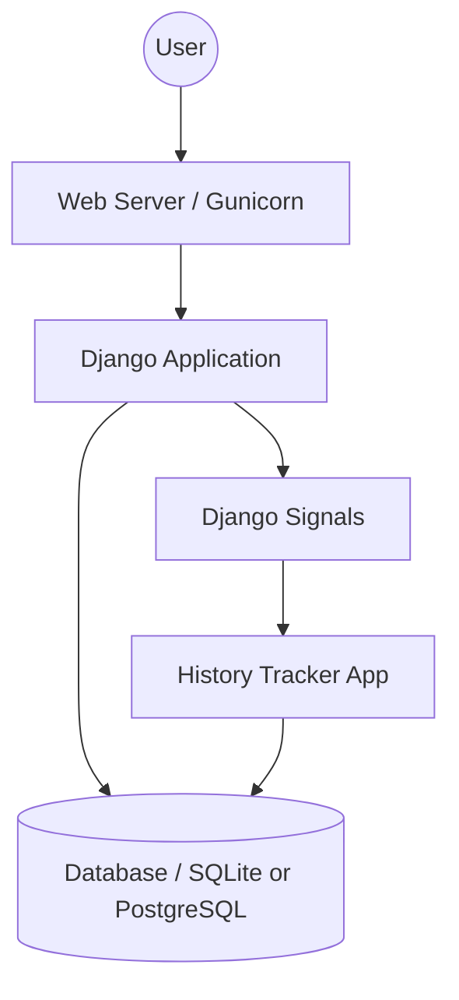
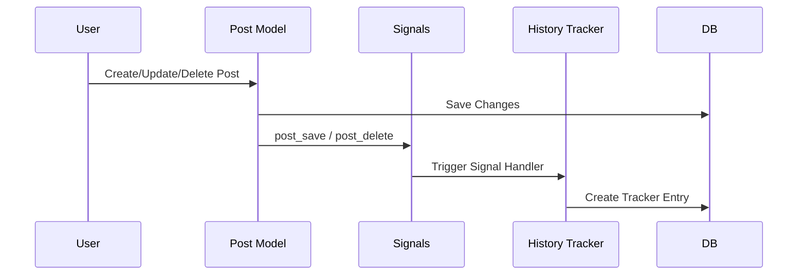

# Django Blog with History Tracker

This is a simple Django-based blog application that includes a custom history tracking system. It is designed to be easily deployable on **Render.com**.

## Features

- **Blog Management**: Create, edit, and delete blog posts.
- **History Tracking**: Automatically tracks changes (Creation, Saving, Deletion) to blog posts using Django signals.
- **Deployment Ready**: Pre-configured for Render.

---

## Project Structure & Configuration

- `blog/`: The main blog application containing models, views, and templates.
- `history_tracker/`: A dedicated app for tracking changes to models.
- `mysite/`: Project configuration directory (settings, URLs, WSGI/ASGI).
- `manage.py`: Django's command-line utility.
- `requirements.txt`: Python dependencies.
- `render.yaml`: Configuration for deployment on [Render](https://render.com/docs/deploy-django).
- `build.sh`: Build script used by Render for environment setup.

---

## Architecture Overview

### System Diagram
The following diagram shows the high-level architecture of the application:

### History Tracking Flow
The `history_tracker` uses Django's signal system to monitor changes in the `Post` model:

---

## Deployment on Render

This project includes a `render.yaml` file for quick deployment:

1. Connect your GitHub repository to Render.
2. Render will automatically detect `render.yaml` and set up the Web Service and Database.
3. The `build.sh` script will:
    - Install dependencies.
    - Run `collectstatic`.
    - Apply migrations.
    - Create a default superuser (`admin1` / `admin123`).

> **Note on Render Databases**: The free tier PostgreSQL databases on Render.com expire after **30 days**. Once the database expires, the Django application will no longer function properly as it won't be able to connect to the database.

---

## Local Development

1. Clone the repository.
2. Install dependencies: `pip install -r requirements.txt`.
3. Run migrations: `python manage.py migrate`.
4. Start the server: `python manage.py runserver`.